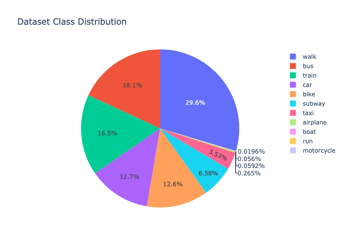

# Identifying transportation mode from location data

Location data is recorded from our phones, wearables, and other devices which helps power mobile applications like maps, delivery, and weather. Understanding a "trip," a sequence of location data points over time, can be crucial for a better user experiences and better potential features in these applications. In this project, we aim to identify the mode of transportation from short trips using tools like K-nearest neighbors, random forests, and neural networks for prediction based on aggregate trip statistics (e.g., average speed, average altitude). We find our models are almost 70% accurate in predicting the mode of transportation. 

## Introduction

There are many uses of location data which is used to power an enormous amount of modern mobile technology. We use Google Maps to figure out how to get between destinations in the shortest amount of time, additionally being able to filter by the desired mode of transportation. We rely on timely, accurate weather predictions to decide what to wear. Apps like Ciclogreen reward users for taking "green" methods of transportation. But are we leveraging this to it's full potential? For instance, a user could input that they biked to work for "green" points, but are we able to verify this actually happened? Or, what if some rain/severe storm is approaching while a pedestrian is walking somewhere? We wouldn't need to notify people in cars/subway about this. Automatically identifying the mode of transportation from live or recent location data would solve a lot of these issues.

We propose to use AI techniques to predict the mode of transportation from users' location data. Specifically, this is a classification problem. K-Nearest neighbors is an algorithm that's simple to implement and easily interpretable, as it finds the closest known data points in feature space and predicts that transport label for a new point. Random forests are also a powerful tool for classification and help prevent overfitting to the training data, so even more subtle patterns in new location data can be correctly classified. Neural networks could be valuable given the large amount of data we have (> 1 million points), but the performance improvement could be considered too small to justify the larger amount of time it would take to train and the complexity of doing so. We would like to experiment with all these methods.

We believe these methods are best for this kind of problem. One method we decided not to pursue was Naive Bayes, since it assumes that features are independent. It's wholly possible that the features don't depend *too* much on each other to dramatically decrease model performance, but we see things like the duration feature being closely related to the distance feature, thus hypothesize that it will cause problems.

A very large component of this project will actually be feature engineering. Although the dataset we found had the information we needed, it was formatted in a way such that it'd be impossible to train a model to predict transportation mode as is. We will have to develop shell scripts to clean the necessary files and do lots of time series indexing to filter and match the data that has labels, since there is extraneous data as well. One limitation might be if we find an imbalance in the number of classes represented by the data, which would make the least represented classes have a lower accuracy. This is very possible because modes like "motorcycle" were almost non-existent compared to modes like "car" in our initial scan of the data.

## Setup

Our initial task was to find a dataset that can provide us with information about the mode of transportation employed by users during their trips. A trip's data would be labeled by its **Transportation Mode** and should contain a sequence of spatiotemporal information collected at a relatively high frequency (to better trace the variation of the parameters/features over the duration of the trip), indicating the precise location of the user and the time it was captured at. 

We found the [**Geolife GPS trajectory**](https://www.microsoft.com/en-us/research/publication/geolife-gps-trajectory-dataset-user-guide/) dataset to be an excellent starting point towards building our desired and final dataset. The data consists of multiple directories (each representing a single user's data) with multiple trajectory files each containing a series of chronological localization data alongside a file indicating the mode of transportation used by its user during a certain timed interval. Each single datapoint for a trip consists of the latitude and longitude coordinates and the altitude (in ft) captured at a moment in time.

 

We then randomly selected a number of users to process their data. This phase consisted of discarding any localization datapoints that did not fall within the time intervals of any labebled trajectories as well as limiting the number of data points retained per user to a maximum of 200 000 points. Once we obtain the labeled spatiotemporal ticks for each trip, we combine each point with the immediate next data point registered to create a movement record for the tripand and compute features like the average distance, time, altitude as well as velocity (distance / time) between each two points. 

For example:

|   | Pre-processing          | Post-processing                                |
|---|-------------------------|------------------------------------------------|
|   | (Lat, Long, Time, Mode) | (Distance, Duration, Velocity, Altitude, Mode) |
| 1 | A [walk]                | A -> B [walk]                                  |
| 2 | B [walk]                | B -> C [walk]                                  |
| 3 | C [walk]                | C -> D [walk]                                  |
| 4 | D [walk]                |                                                |

Our final dataset totals 1 149 022 datapoints collected from the data of 19 different users. The columns include the Distance(m), Duration(s), Velocity(m/s), Altitude(m) features as well as the target column containing the labels for the TransportMode of each datapoint. 

The distribution of the labels in the dataset looks as follows:

To obtain to final cleaned dataset, download the data from the Geolife GPS Trajectory linked above. Then, download the `clean.sh` script and copy it into the data directory. Change the first line of the script to the path where you want the cleaned data to be copied to. Finally, run `./clean.sh`, and you may have to `chmod u+x clean.sh` beforehand. 

The experimental setup we implemented focused on splitting our generated dataset to a train (80%) and test (20%) data splits and subsequently train different classification models and compare the accuracy and score results. We decided to experiment with the **K-Nearest Neighbors** and **Random Forest Classifiers**, with hyperparameter tuning for chosen parameters using KFold cross validation. In the KNN model we work on finding the optimal number of neighbors to be considered in the model, while for Random Forest we wanted to optimize both the tree depth and number of trees generated.

Our next step was to implement a Neural Network to train our data on. The structure of the network will have one hidden layer of 128 or 256 neurons, and we plan to compare to see which is better. We will use a ReLU activation function and a log softmax applied on the output layer.

## Results

### Main results

Our test results only encompassed predicting the mode of transport for a "trip" with two data points, of which most were a few seconds apart. Overall, we were able to achieve decent accuracy using straightforward methods like K-Nearest Neighbors and Random Forest. 

Our neural networks were trained on a NVIDIA V100 GPU on the Northeastern Discovery cluster. 

#### KNN

Train accuracy: 0.687

Test accuracy: 0.662

#### Random Forest

Train accuracy: 0.643

Test accuracy: 0.645

#### Gradient Boosting

Train accuracy: 0.644

Test accuracy: 0.643

#### Neural Network

Test accuracy: 0.547

Please use light mode to properly view the titles and labels on the following graphs:

#### Ablation study

We hypothesized that these algorithms might perform worse on trips where the time in seconds between the two points was very large. That's because an extreme majority of the training data actually had a time less than 5 seconds between the points in the trip. We chose to test this using random forest, and surprisingly found it performs better on large trips in the dataset with an accuracy of 0.731.

### Supplementary results

We used K-fold cross validation to find the optimal number of neighbors to use for our K-Nearest Neighbors algorithm. This was done using the GridSearchCV function from sklearn.

This figure demonstrates that the optimal number of neighbors is 19.

We also used K-fold cross validation for the Random Forest algorithm, this time using GridSearchCV to cross validate the number of trees and the max depth. 

This figure demonstrates that the optimal max depth is 7, and number of trees is 19.

K-fold cross validation was also used on the Gradient Boosting model, using GridSearchCV, to determine the optimal number of estimators and the learning rate.

The figure demonstrates that the optimal learning rate is 0.1, and the best number of estimators is 19.

## Discussion

The best test performance we achieved was 0.645 by random forest, which marginally beat KNN and gradient boosting. 

Although the performance of our models aren't bad by any means, we think there's still room to improve. A large part of this project was feature engineering, so we could take the users' location data and formulate it into an accomplishable supervised learning problem. We think our features can be better. For instance, maybe the model will be able to recognize patterns in latitude/longitude and create a "map" (maybe a certain group of coordinates labeled boats will end up being on the water). We're currently abstracting away this information by only telling the model the distance between points in the trip. 

For neural networks, we chose a small number of epochs because the amount of data in 1 epoch was very large. With different learning rate and model sizes, the best model still struggled to get under 1.25 loss and seemed to converge there. It's possible the large number of parameters caused overfitting to the few features, which would explain why the test accuracy was less than other methods.

As far as validation goes, it's always possible to increase the range of hyperparameters we're checking. This would make the grid search run for longer, but we could see marginal improvements in accuracy if there are more trees in a random forest, for instance. Our current searches were limited to keep runtime within a reasonable timeframe. 

## Conclusion

Our goal was to use a sequence of location data points to predict the mode of transport for a user, and to use the classification algorithms we wanted, we had to break it down into a much smaller problem. To break it down, we had to engineer features to feed into our models from the raw latitude/longitude/altitude sequences. Algorithms like K-nearest neighbors and random forest had the best accuracy of about 66%, and this was fine-tuned with cross-validation to extract the best performance. 
